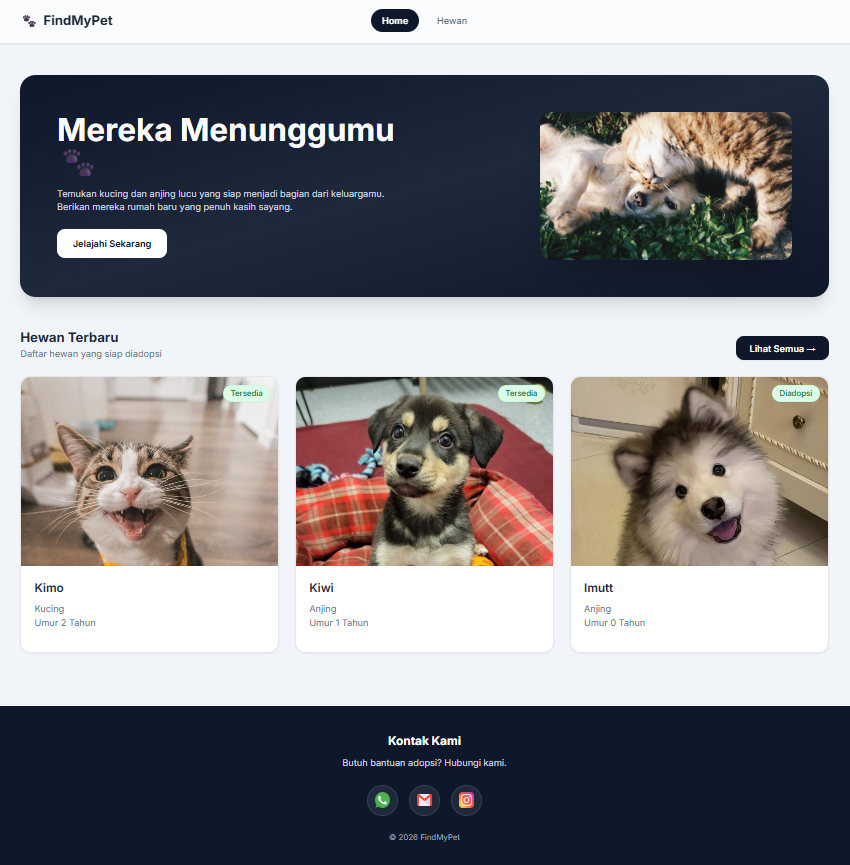
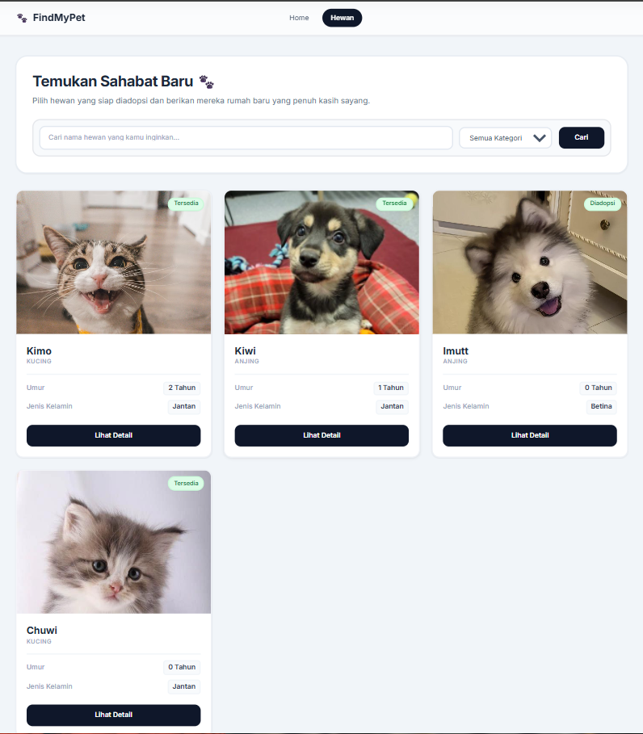
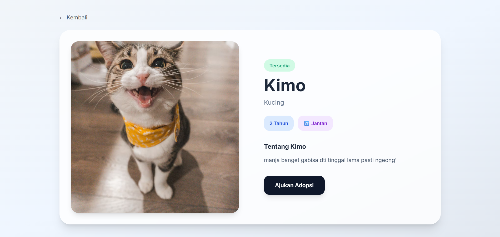
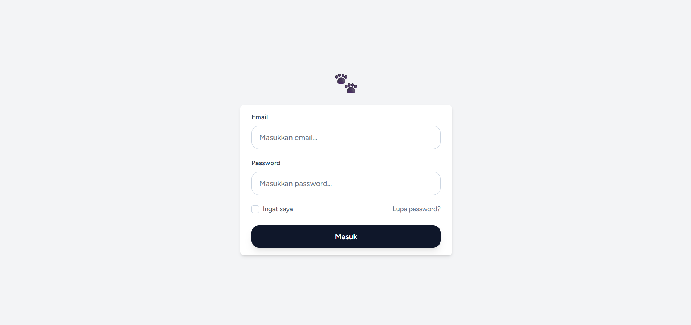
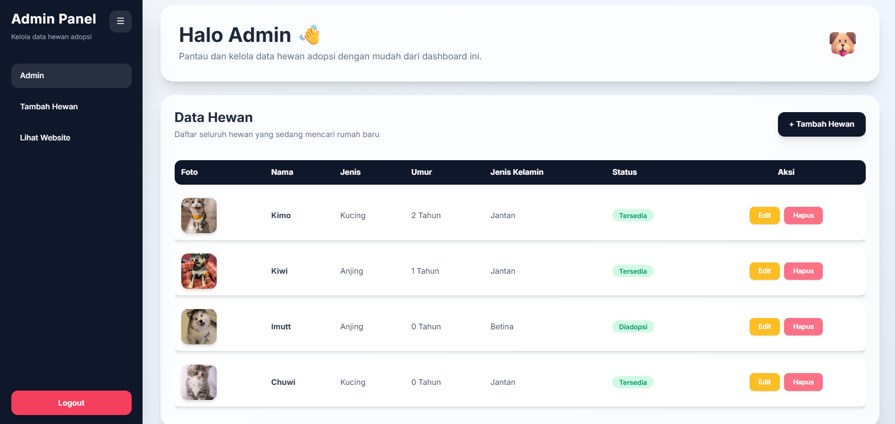
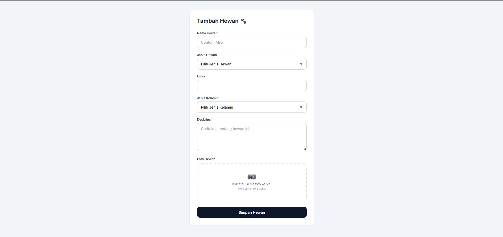
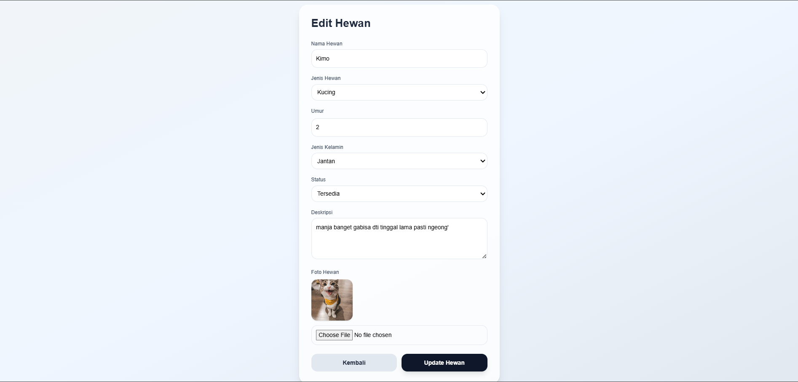
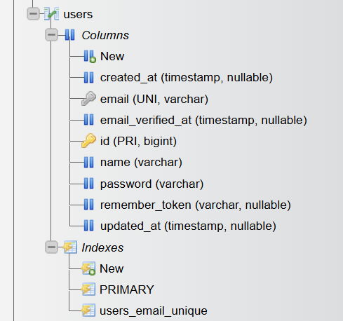
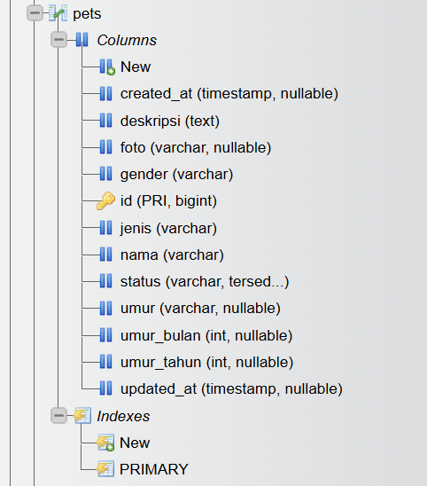

# FindMyPet 🐾

FindMyPet adalah website adopsi hewan anjing dan kucing menggunakan laravel dan Tailwind CSS

## Fitur
- Login & Register
- Dashboard Admin
- Tambah Hewan
- Edit & Hapus Hewan
- Detail Hewan
- Adopsi via WhatsApp

---

## Home

Halaman utama website yang menampilkan beberapa hewan terbaru yg siap diadopsi

---

## Halaman Hewan

Halaman daftar seluruh hewan yang tersedia untuk diadopsi, pengguna bisa mencari nama hewan atau kategori hewan

---

## Detail Hewan

Halaman detail hewan yang berisi foto, nama, umur dan deskripsi tentang hewan yg siap diadopsi serta tombol adposi yang menghubungi admin langsung melalui Whatsapp

---

## Screenshot Login

Halaman login yang digunakan untuk masuk ke dashboard admin

---

## Dashboard Admin

Halaman dashboard admin untuk mengelola hewan, tambah data hewan baru, edit data hewan, dan hapus data hewan

---

## Tambah Hewan

Halaman tambah hewan digunakan admin untuk menambahkan hewan baru 

---

## Edit Hewan

Halaman edit hewan digunakan admin untuk mengedit perkembangan hewan  

---

## Database Users

Table users tempat menyimpan data akun admin 

---

## Database Pets

Tabel pets tempat menyimpan data hewan 

---

## Penjelasan Sistem

Website ini dibuat untuk membantu proses adopsi hewan secara online, lebih cepat dan praktis karena pengguna bisa langsung menghubungi admin melalui WhatsApp dari website tanpa harus mencari cari kontak yang ingin di hubungi jika akan mengadopsi hewan. User dapat melihat daftar hewan yang tersedia dan membuka detail hewan sebelum melakukan adopsi melalui WhatsApp. Admin dapat login ke dashboard untuk mengelola data hewan seperti menambah, mengedit, dan menghapus data. Tombol Dashboard Admin hanya muncul ketika admin sudah login. Jika belum login maka tombol tersebut tidak akan tampil pada navbar website sehingga pengguna tidak akan bisa mengakses user admin.

---

## Tools yang Digunakan

- Laravel 12
- PHP
- MySQL
- Tailwind CSS
- Github

---
